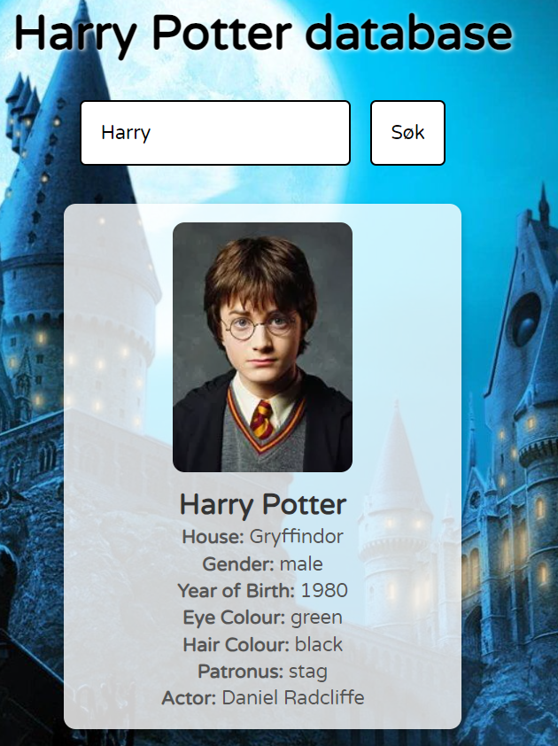

# Harry Potter Character Search

Dette prosjektet er en webapplikasjon som bruker et API for å hente og vise informasjon om karakterer fra Harry Potter-universet. Brukeren kan søke etter en karakter ved navn, og applikasjonen vil vise karakterens bilde og informasjon, som f.eks. hus, kjønn, fødselsår, øyefarge, hårfarge, patronus og skuespiller.

## Funksjonalitet

- Brukeren kan skrive inn navnet på en karakter (eller en del av navnet) og trykke på **Søk** eller trykke på **Enter**-tasten for å søke.
- Applikasjonen viser 8 forskjellige egenskaper om karakteren: bilde, navn, hus, kjønn, fødselsår, øyefarge, hårfarge, patronus og skuespiller.
- Hvis karakteren ikke finnes, vises en melding om at ingen karakter ble funnet.
- Feilhåndtering: Hvis det oppstår en feil med API-et, vises en feilmelding på skjermen.

## Teknologier brukt

- **HTML**: For strukturen på nettsiden.
- **CSS**: For stil og layout.
- **JavaScript**: For funksjonalitet og kommunikasjon med API-et.
- **Harry Potter API**: Brukes for å hente karakterdata.

## Hvordan fungerer programmet?

1. Brukeren skriver navnet på en karakter i input-feltet.
2. Når brukeren trykker på søkeknappen eller **Enter**-tasten, sendes et API-kall til [Harry Potter API](https://hp-api.onrender.com/api/characters).
3. Informasjonen om karakteren blir hentet og vist på nettsiden.
4. Hvis ingen karakter blir funnet, vises en feilmelding.

## Installasjon

For å kjøre dette prosjektet lokalt:

1. Klon eller last ned prosjektet til din lokale maskin.
2. Åpne **index.html** i en nettleser.
3. Ingen ekstra avhengigheter er nødvendig da API-et er tilgjengelig uten autentisering.

## Skjermbilder

Slik ser applikasjonen ut når en karakter blir funnet:

## Farger brukt

For å velge farger til nettsiden kan du bruke [Adobe Color](https://color.adobe.com/nb/).

## Forbedringer

- Legg til flere detaljer om karakterene.
- Håndtere situasjoner der flere karakterer har like navn eller at deler av navnet stemmer overens.
- Gi brukeren muligheten til å søke etter flere karakterer samtidig.

## Kilder

- [Harry Potter API](https://hp-api.onrender.com/api/characters)
- [Adobe Color](https://color.adobe.com/nb/)
